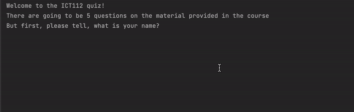

<h1 align="center">Quiz Game</h1>

<h2>Project description</h2>
A simple command-line <b>python</b> quiz game that tests your knowledge on various python topics. The game randomly selects 5 questions from a predefined list and provides feedback on the correctness of your answers.

<h2>Features</h2>
<ul>
  <li>Randomly selects 5 questions from a pool of questions.</li>
  <li>Compares user input to the correct answer and provides feedback.</li>
  <li>Tracks and displays the user's score at the end of the quiz.</li>
</ul>

<h2>Technologies Used</h2>

<h2>Getting Started</h2>
To get a local copy up and running, follow these simple steps:
 

Clone the <code>simple-python-apps</code> repository and fetch only the quiz-game-branch branch: 
git clone -b quiz-game-branch --single-branch https://github.com/Yuliia-Kruta/simple-python-apps.git 
Navigate to the project directory and run the <code>chatbot.py</code> script.

<h2>License</h2>
Distributed under the MIT License. See LICENSE for more information.
