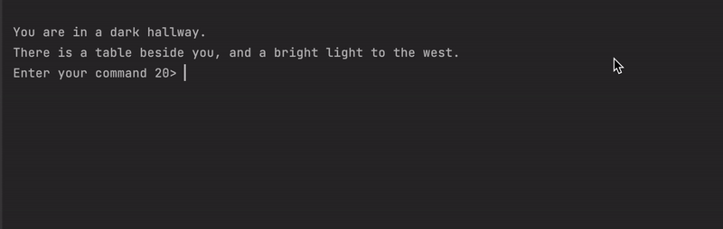

<h1 align="center">Text-based Adventure Game</h1>

<h2>Project description</h2>
A simple text-based adventure game called "Creepy House" written on <b>Python</b>. Players can navigate through different rooms, pick up objects, and interact with the environment using basic commands.

<h2>Features</h2>
<ul>
  <li>Navigate through rooms using compass directions.</li>
  <li>Pick up and drop objects.</li>
  <li>Inventory management to keep track of collected items.</li>
</ul>

<h2>Technologies Used</h2>

<h2>Getting Started</h2>
To get a local copy up and running, follow these simple steps:
 

Clone the text-adventure-game-branch branch. 
Run the text_game_robust.py script.

<h2>License</h2>
Distributed under the MIT License. See LICENSE for more information.
